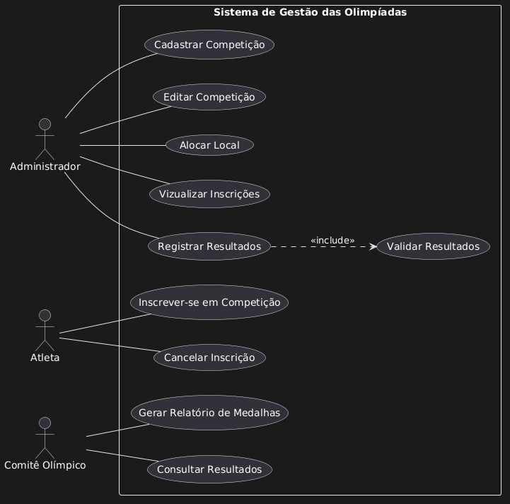
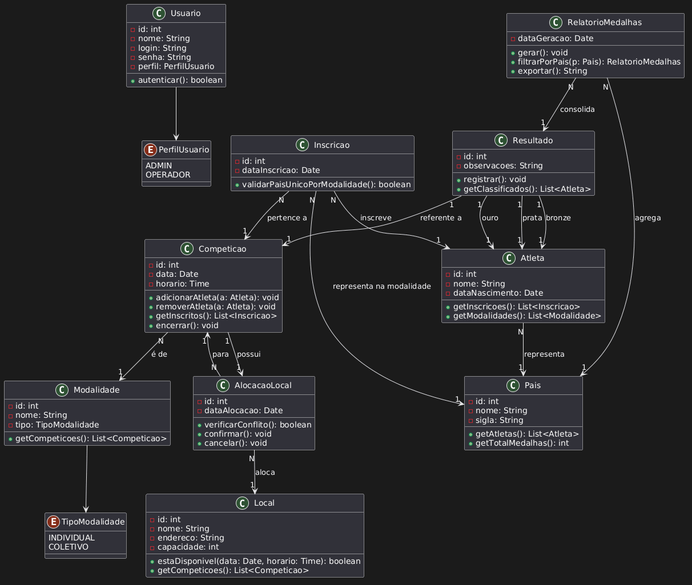
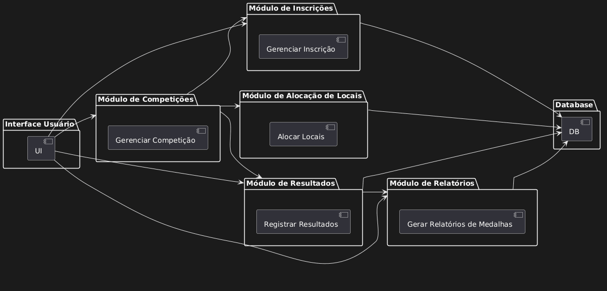
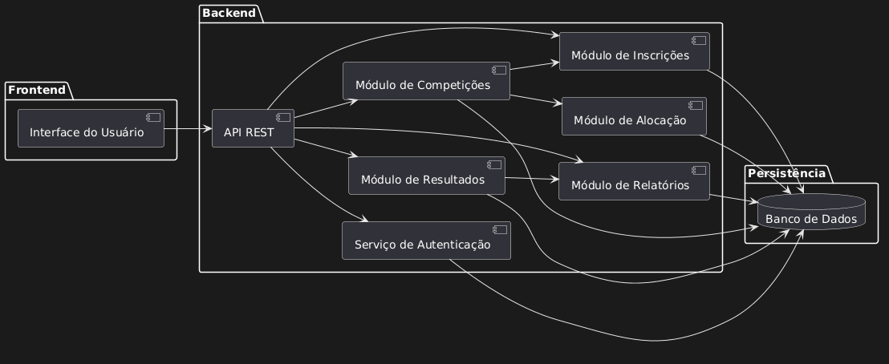
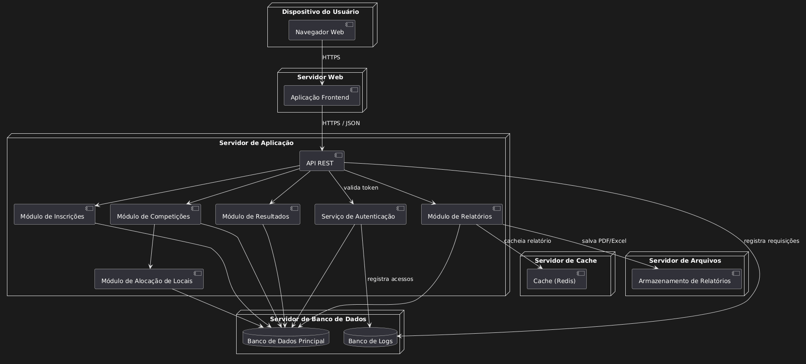

# 🏅 Sistema de Gestão das Olimpíadas (SGO)

## 📌 Descrição

O Sistema de Gestão das Olimpíadas (SGO) tem como objetivo gerenciar os principais aspectos de um evento olímpico, incluindo cadastro de competições, inscrição de atletas, alocação de locais, registro de resultados e geração de relatórios de medalhas.

O sistema foi modelado utilizando diagramas UML com o auxílio da ferramenta PlantUML.

---

## 🎯 Objetivo

Desenvolver a modelagem de um sistema que permita organizar e controlar eventos olímpicos de forma eficiente, garantindo consistência nas informações e evitando conflitos operacionais.

---

## 📖 Regras de Negócio

* Cada competição possui nome, data, horário, local e atletas inscritos.
* Um atleta pode participar de várias competições.
* Um atleta representa apenas um país por modalidade.
* Um local não pode ter mais de uma competição ao mesmo tempo.
* Resultados devem definir 1º, 2º e 3º lugar.
* O sistema deve gerar relatórios de medalhas por país.

---

## 🧑‍💻 Histórias de Usuário

**US01 - Cadastrar Competição**
Como administrador, quero cadastrar competições para organizar os eventos.

**US02 - Inscrever Atleta**
Como atleta, quero me inscrever em competições para participar dos eventos.

**US03 - Alocar Local**
Como administrador, quero alocar locais para evitar conflitos de horário.

**US04 - Registrar Resultados**
Como administrador, quero registrar resultados para definir vencedores.

**US05 - Gerar Relatório de Medalhas**
Como comitê olímpico, quero visualizar relatórios de medalhas por país.

**US06 - Consultar Resultados**
Como usuário, quero consultar os resultados das competições.

---

## 📊 Diagramas UML

### 📌 Diagrama de Caso de Uso



---

### 📌 Diagrama de Classes



---

### 📌 Diagrama de Pacotes



---

### 📌 Diagrama de Componentes



---

### 📌 Diagrama de Implantação



---

## 📁 Estrutura do Projeto

```
/sgo
 ├── README.md
 ├── imagens/
 │   ├── diagrama-de-caso-de-uso.png
 │   ├── diagrama-de-classes.png
 │   ├── diagrama-de-pacotes.png
 │   ├── diagrama-de-componentes.png
 │   ├── diagrama-de-implantacao.png
 │
 ├── codigos/
     ├── diagrama-de-caso-de-uso.puml
     ├── diagrama-de-classes.puml
     ├── diagrama-de-pacotes.puml
     ├── diagrama-de-componentes.puml
     ├── diagrama-de-implantacao.puml
```

---

## 🛠️ Tecnologias Utilizadas

* PlantUML (modelagem UML)
* GitHub (versionamento e entrega)


---
